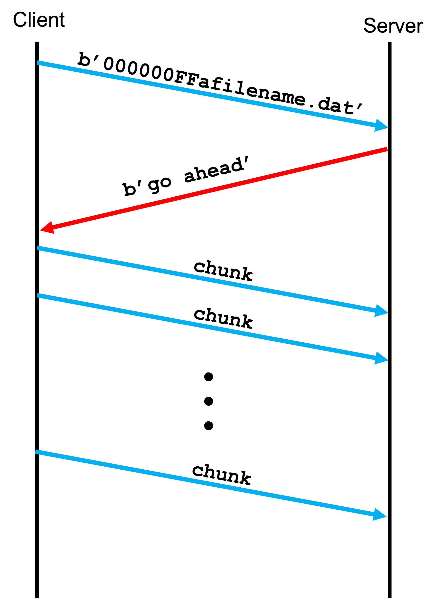

# CSCI-330 Programming Assignment 3: TCP File Transfer - Muliple Clients

## Setup and Installation

This programmng assignment should be templated and cloned locally on your computer. 

## 1. Introduction

This exercise is the same file transfer protocol as in the previous TCP file transfer system except that you will extend it to allow multiple simultaneous client connections.

To accomplish this task, you will convert the server you completed in the previous socketProgramming2 project into a multithreaded server capable of servicing multiple clients.

If you are unfamiliar with how to create a thread in Python, please refer to the following resources:

1. [Threading - Python Docs](https://docs.python.org/3/library/threading.html)
2. [Multithreading in Python](https://www.geeksforgeeks.org/multithreading-python-set-1/)
3. [An Intro to Threading in Python](https://realpython.com/intro-to-python-threading/)

## 2. Protocol

In this mini-project, you will implement a simple protocol for file transfer over TCP.  The algorithms described below implements the following simple protocol.

<figure style="text-align:center;">
	

	<figcaption style="font-weight:bold; color:#0055ee;">Figure 1: Simple file transfer protocol.</figcaption>
</figure>

## 3. The Server Algorithm (Implemented in Previous Project)

1. Create a socket using the `socket` function and bind it to the (ip, port) pair. **(Implemented)**
2. Receive a message from the client using the `recv` function.
3. Decompose the message into an 8-byte integer representing file size. The rest of the bytes should be decoded into a string representing the file name. Use `get_file_info()`.
4. send `b'go ahead'` message to the client.
5. Using the filename provided, open the file for writing using the `with` python statement. **NOTE: since you will be transferring a file over localhost to the same directory, it is important that you modify the filename, say by adding a *.temp* extension, to avoid overwriting the original file.** (Implemented)
6. Inside the *with* statement, 
	<ol type="a">
	<li>Receive a chunk of data.</li>
	<li>Update the number of bytes received.</li>
	<li>Write the data to the file.</li>
	<li>Continue to perform steps 7a-c until all bytes have been received.</li>
	</ol>
7. If an exception occurs, the file should be deleted. (Implemented)
8. Close the client socket. (Implemented)
9. Repeat steps 2 - 8. (Implemented)

## Task - Server That Can Service Multiple Clients

Your task in this assignment is to implement a server that can service multiple clients simultaneously.  There are several approaches that can be taken, including using

1. [Threading](https://docs.python.org/3/library/threading.html)
2. [Select](https://docs.python.org/3/library/select.html#module-select)- waiting for I/O completion
3. [Selectors](https://docs.python.org/3/library/selectors.html#module-selectors) - High level I/O Multiplexing
4. [asyncio](https://docs.python.org/3/library/asyncio.html) -  (if asyncio is confusing, try [gevent](https://www.gevent.org/api/index.html#networking))
 a. Tutorial on [asyncio/coroutines](https://realpython.com/async-io-python/#the-asyncio-package-and-asyncawait)
 b. Tutorial to [create an asyncio server](https://superfastpython.com/asyncio-server/)

The implementation below runs you through a multhreaded server; however, I highly recommend that you try (in the summer) implementing the server using the other methods above. Select and Selectors, are probably the better and less error prone way of implementing such a server.

## 4. Implementing the Multithreaded Server

In our previous implementation, steps 5 through 8 above were placed in a function called `upload_file`.  Steps 1 through 9 were in a function called `start_server`

Here we will need to put the client connection functionality in a separate method so that a thread of execution can be started for each client connection.

A possible implementation of this server is:

1. Create a socket using the `socket` function and bind it to the (ip, port) pair. **(Same as step 1 in The Server Algorithm section above)**
2. Listen for up to five (5) connection request. **(implemented)**
3. Wait and accept a connection request.
4. Create a thread that will run a function called `service_client_connection`.
5. Start the thread.
6. Goto step 3

The function `service_client_connection` implements  steps 2 through 8 in the previous server algorithm section, with steps 5 - 8 consisting of the invocation of the `upload_file` function.

## 5. Testing Your Implementation

You can test your implementation by running the server and client on the same machine. Use the client from the previous project to test this multithreading server.  In case you did not complete the previous assignment, use the client provided with this assignment.  Since you know the client runs correctly, you can run multiple clients simultaneously.  To simulate this, place artificial pauses in your client that will allow you to test whether the server can handle several clients simultaneously.  The client provided with this assignment includes and input function call that pauses the client until the return key is pressed.  This will allow you to start several clients that connect with the server and wait for you to press the return key before transmitting the file. 

## 6. Submitting This Work

You are required to submit your code on the CodeGrade link on Blackboard.  Further instructions will be provided about submission in Discord.

## Tips

- Make sure to handle errors in your code.
- Pay attention to the TODO tasks and how they are mapped to the algorithm steps above.  This will help guide you in implementing the code.
- Read the Python documentations for the sys, os, and os.path modules along with associated examples.  Avoid Googling the answer as this will get you into the habit of reading documentaton.

Good luck and happy coding!